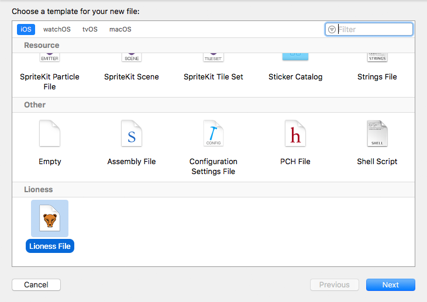

# Xcode file template
The Lioness Xcode file template allows the creation of a Lioness source file via the ```File -> New -> File...``` menu in Xcode.



## Installation
* Create a new folder in ```~/Library/Developer/Xcode/Templates/```
	* e.g. using: ```mkdir -p ~/Library/Developer/Xcode/Templates/Lioness```
<br>*The name of this folder will be the title of the templates section in Xcode*
	* Add [Lioness File.xctemplate](Lioness%20File.xctemplate) to the newly created folder
	* You may need to restart Xcode before you see the new file template
